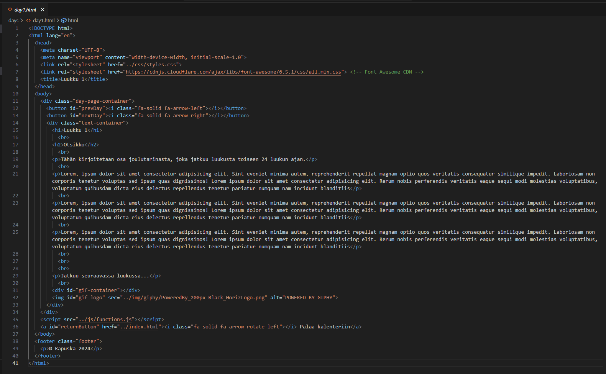
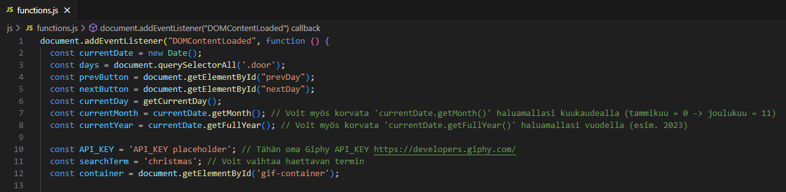

# Joulukalenteri 

## Tässä README-tiedostossa esitellään Joulukalenteri-sovellus. Sovelluksessa on 24 luukkua, jotka avautuvat vasta, kun niiden päivämäärä vastaa nykyistä päivämäärää. 

### Ominaisuudet ja tekniset tiedot:

Sovellus on kehitetty käyttäen HTML-, CSS- ja JavaScript-ohjelmointikieliä.

Tämä versio sovelluksesta tarjoaa vain mallipohjan sisällönluomista varten ja sovelluksen käyttöönottajan tulee itse luoda sisältö päiväkohtaisiin .html-tiedostoihin.

Sovellus hyödyntää avointa Giphy-rajapintaa lisätäkseen visuaalista sisältöä luukkuihin.

Sovellus on suunniteltu responsiiviseksi, joten se toimii saumattomasti eri laitteilla, kuten tietokoneilla, tableteilla ja älypuhelimilla.

Sovellukseen on luotu toiminnallisuus, joka estää luukkujen ennenaikaisen avaamisen kolmella eri tavalla:
- Luukkuja ***ei voi*** avata ennen määräpäivää.
- Luukkujen sisällä ***voi*** navigoida ***ainoastaan*** kuluvan ja menneiden päivien välillä.
- Luukkuja ***ei voi*** avata ennenaikaisesti URL-polkua käyttäen.

> Näissä tilanteissa käyttäjä ohjataan aina "forbidden"-polkuun.

### Käyttöönotto:

1. Lataa sovelluksen tiedostot GitHubista.
2. Luo päiväkohtaiset tekstisisällöt kullekin päivälle:
  
3. Muuta päivämäärä haluamaksesi ja lisää Giphyn API-key:
  
4. Testaa toiminnot avaamalla index.html-tiedosto selaimessa.
5. Luo sovelluksesta WEB-sivu esimerkiksi GitHub Pages työkalulla: https://pages.github.com/
6. Jaa WEB-sivun URL haluamillesi henkilöille.

### Huomio:

Tämä sovellus on luotu opetus- ja viihdetarkoituksiin. En takaa sen virheettömyyttä tai sopivuutta mihinkään tiettyyn käyttötarkoitukseen.

